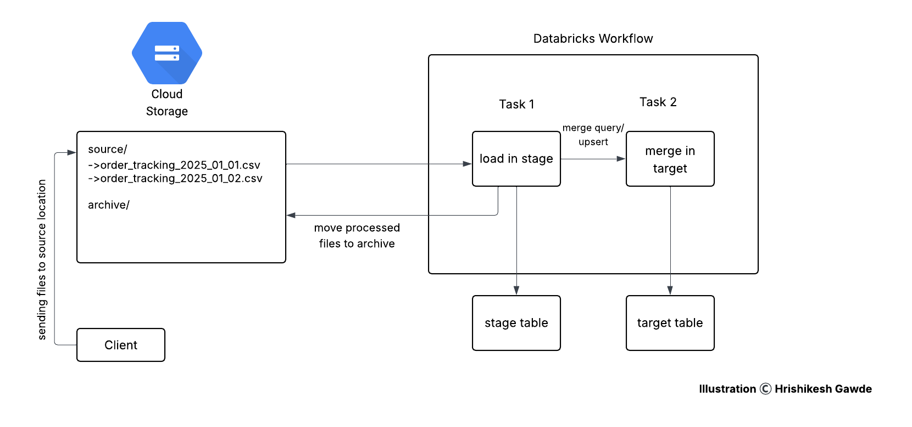

# Event Driven Incremental Ingestion Pipeline for Order Tracking

## Introduction
This project demonstrates a cloud-native, event-driven architecture for implementing incremental load ingestion into Delta Lake tables on Databricks. It uses file arrival as the event trigger and performs SCD1 (Type 1 Slowly Changing Dimension) merge operations for upserting data into a target table. The project reflects modern, scalable approaches to real-time data engineering pipelines using Databricks Workflows and cloud object storage.

## Problem Statement
Organizations handling daily order tracking data require efficient mechanisms to ingest only newly arrived or updated records while ensuring data accuracy and consistency. Full refresh ingestion methods are expensive and inefficient. This project addresses the need for an incremental ingestion system that is automated, event-driven, and Delta Lake optimized, ensuring upserts based on the latest tracking updates.

## Architecture
The architecture consists of:
- A GCS bucket (orders-data) with a source/ folder for incoming files and an archive/ folder for processed ones.
- A Databricks Workflow with two sequential tasks:
  - Task 1: Load data into a staging Delta table and archive the source files.
  - Task 2: Merge data from the staging table into the target Delta table using SCD1 logic on tracking_num.

## Technology Used
- Google Cloud Storage
- PySpark
- Delta Lake
- Databricks
- Databricks Workflows
- GitHub

## Dataset Used
Daily order tracking CSV files are uploaded to the GCS source/ folder.
#### Input Data
`order_tracking_yyyy_mm_dd.csv`: order_num, tracking_num, pck_recieved_date, package_deliver_date, status, address, last_update_timestamp

## Scripts for Project
- orders_stage_load.ipynb:
Reads CSV files from the source/ folder in GCS, loads data into the staging Delta table, and moves the processed files to the archive/ folder to avoid duplicate processing.
- orders_target_load.ipynb:
Performs an upsert (SCD1 merge) from the staging table into the target Delta table using the condition stage.tracking_num = target.tracking_num. Existing records are updated, and new ones are inserted.

## Output and Impact
- A production-grade ingestion pipeline that performs incremental loads with zero duplication.
- Efficient merge handling using Delta Lake's ACID capabilities.
- Automated file-triggered orchestration using Databricks Workflows.
- Business value derived from maintaining accurate, real-time order tracking data, with updates reflected based on the latest timestamp.

## My Learnings
- Setting up event-driven pipelines using file arrival triggers in Databricks Workflows.
- Implementing SCD1 logic using Delta Lake and understanding its merge semantics.
- Hands-on experience with Databricks integration with GitHub for notebook-based CI/CD.
- Managing incremental ingestion patterns and archiving logic to prevent reprocessing.
- Efficient PySpark scripting and parameterization within notebooks for production workflows.

